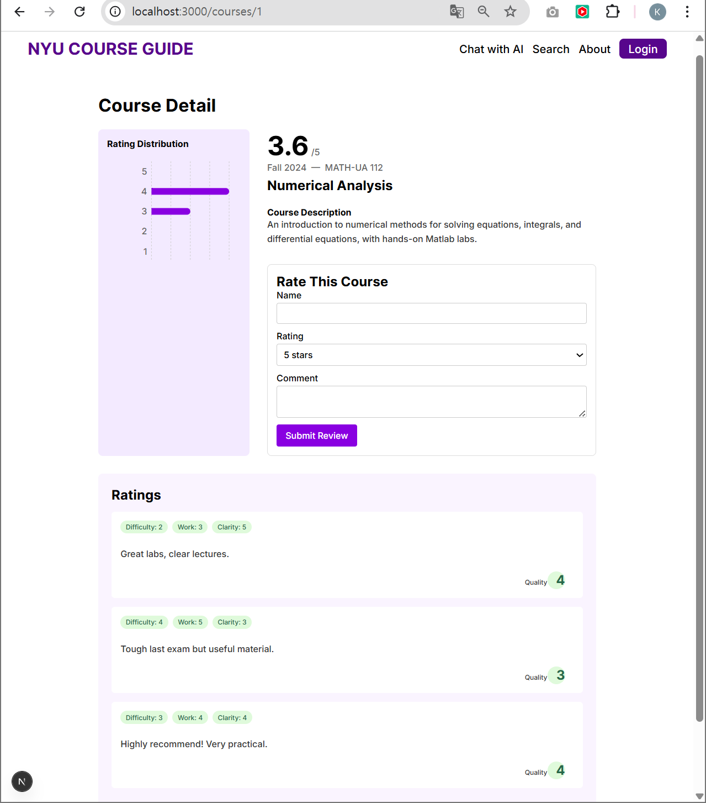

# NYU Course Guide

A dynamic web application that helps NYU students explore, search, and evaluate courses using real student-generated feedback, ratings, and useful filters.

## 📌 Problem Overview

While selecting courses, students often face the following challenges:

- **PROBLEM 1**  
  Although professor evaluations exist, there is no access to **individual course reviews**, making it difficult to judge specific classes based on real student experience.

- **PROBLEM 2**  
  **Syllabi are not accessible** during registration, making it hard to evaluate grading policy, assignments, and attendance system.

- **PROBLEM 3**  
  Due to the **sheer volume and lack of structured information**, it's difficult to find courses that match a student's personal preferences and conditions.

---

## ⚙️ Tech Stack

- **Frontend**: React.js, Next.js  
- **Backend**: Next.js (API routes)  
- **Styling**: SASS, Material UI  

---

## 🔥 Features

### 🚪 Landing Page

<table>
  <tr>
    <td width="50%">
      
    </td>
    <td width="50%">
      <ul>
        <li>Shows curated course categories:</li>
        <ul>
          <li>Top-Rated</li>
          <li>Low-Difficulty</li>
          <li>Department-specific courses</li>
        </ul>
      </ul>
    </td>
  </tr>
</table>

---

### 🔍 Search Page

<table>
  <tr>
    <td width="50%">
      
    </td>
    <td width="50%">
      <ul>
        <li>Keyword search by course name, professor, department, etc.</li>
        <li>Filter by:
          <ul>
            <li>Department</li>
            <li>Professor</li>
            <li>Credits</li>
          </ul>
        </li>
        <li>Sort by rating or difficulty</li>
        <li>Click a course to view detailed information</li>
      </ul>
    </td>
  </tr>
</table>

---

### 📖 Course Detail Page

<table>
  <tr>
    <td width="50%">
      
    </td>
    <td width="50%">
      <ul>
        <li>Displays course name, semester, code, description, and overall rating</li>
        <li>Write a review with star rating and comment</li>
        <li>View rating distribution graph</li>
        <li>Browse written reviews from other students</li>
      </ul>
    </td>
  </tr>
</table>

---

## Future Plans

- Connect to NYU’s real course API or internal dataset  
- Add user login and review history  
- Build a course recommendation chatbot that reflects each user’s interests  

